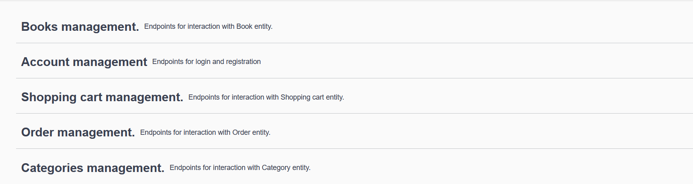
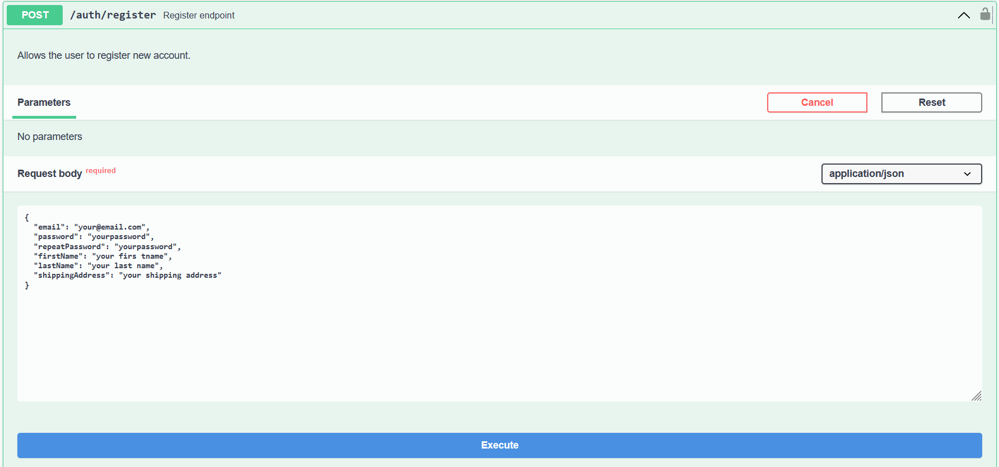
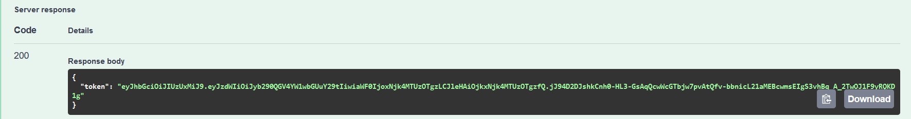
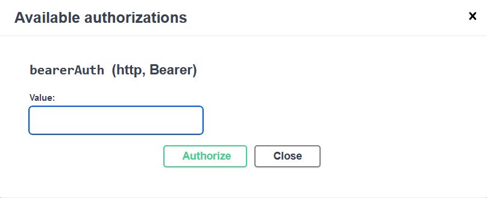

# Book-store api

It is a server web interface, build with Java, Spring Boot, Docker, MySql.
The project follows REST principles implemented with HTTP methods and include all CRUD operations,
such as **CREATE**, **READ**, **UPDATE** and **DELETE**.
There are also implemented authentication with JWT bearer token.
And authorization is realized with RBAC (Role Based Access Control).
This application allows you to look for different books in the store. You can get specific book and look information
about.
Also, you have a shopping cart where you can collect books would you like to buy. You can add books with different
quantity
remove it from shopping cart and change quantity. After you can create order with your items from shopping cart.
As an admin, you can create, delete and update books same with categories. Also, you may change order status.
My application is typical solution of simple marketplace.

**Summary**

**Available for unauthorized users**

- POST /api/auth/register (Register endpoint)
- POST /api/auth/login Login endpoint

**Available for USER**

- GET /api/books (Get all books.)
- GET /api/books/{id} (Get book by ID.)
- GET /api/books/search (Search books.)
- GET /api/categories/{id}/books (Get book by category ID.)
- GET /api/categories (Get all categories.)
- GET /api/categories/{id} (Get category by ID.)
- GET /api/cart (Get logged-in user shopping cart.)
- POST /api/cart (Add new book to the shopping cart.)
- PUT /api/cart/cart-items/{cartItemId} (Update book quantity.)
- DELETE /api/cart/cart-items/{cartItemId} (Delete book from cart.)
- GET /api/orders (Get order history.)
- GET /api/orders/{id} (Get specific order item.)
- POST /api/orders (Open new order.)

**Available for ADMIN**

- PUT /api/books/{id} (Update book by ID.)
- POST /api/books (Create new book.)
- DELETE /api/books/{id} (Delete book by ID.)
- PATCH /api/orders/{id} (Update order status.)
- PUT /api/categories/{id} (Update category by ID.)
- POST /api/categories (Create new category.)
- DELETE /api/categories/{id} (Delete category by ID.)

## Data Models

Here are some of the key data models used in the Book-store API:

## Technologies

* Java 17
* Spring Boot, Spring Security, Spring Data JPA, Spring Web, Spring Tests
* Docker
* MySQL
* Liquibase
* Swagger
* Hibernate
* JWT (JSON Web Tokens)

## Installation and Launch

1. Launch docker engine on your system.
2. Fork this repository.
3. Clone your forked repository.
4. Configure your database settings in the .env file.
5. Run command `mvn clean package ` for build project.jar.
6. Run command `docker-compose build` for build docker container.
7. Run command `docker-compose up` for start project.

Use Postman or Swagger for sending
requests. ([Link for Postman](http://localhost:8088/api/auth/register), [Link for Swagger](http://localhost:8088/api/swagger-ui/index.html))

# 1. **For user access, please register a new account first.**
   

# 2. **After, logging in, you will receive a bearer token.**
  

# 3. **Copy value from response. Push button:**
   

# 4. **Paste your token and click 'authorize'**
   

   **For admin access, use or change the admin email in `application.properties` file. All conditions for sending a
   request are the same as for the user.**
